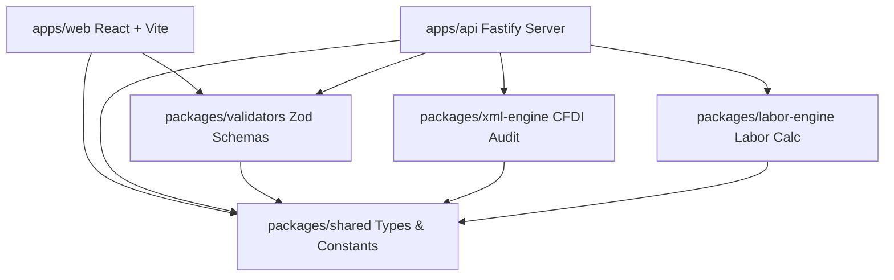

# Fiscora SaaS — Documento de Arquitectura

Este documento describe las bases técnicas, la separación de responsabilidades y las decisiones de diseño adoptadas en la cimentación del monorepo Fiscora.

---

## 1. Diseño de Arquitectura del Monorepo

Fiscora se estructura como un **Monorepo gestionado por pnpm workspaces**. Esto nos permite aislar componentes lógicos (como los motores fiscales y esquemas de validación) manteniéndolos en TypeScript con tipado estricto, sin requerir la publicación en registros de paquetes NPM.

### Componentes Internos

1. **`apps/web`**: Aplicación de página única (SPA) cliente construida sobre React y Vite, diseñada utilizando variables CSS dinámicas para soportar cambio de temas light/dark y personalizaciones de marca de organización (`AccountBranding`).
2. **`apps/api`**: Servidor REST basado en Fastify. Fastify fue seleccionado por encima de Express por su rendimiento superior y su soporte nativo para esquemas JSON de validación.
3. **`packages/shared`**: Declaración centralizada de enums y constantes del negocio (p. ej., planes de Stripe, llaves de módulos habilitados).
4. **`packages/validators`**: Biblioteca compartida de schemas Zod. Al validar las peticiones de registro, login, RFCs y solicitudes de cálculo tanto en el Frontend como en el Backend de forma idéntica, evitamos la duplicación de código de validación.
5. **`packages/xml-engine`**: Motor encargado de recibir cadenas de comprobantes digitales (CFDI XML), detectar su tipo legal (I, E, P, N, T) y auditar su contenido aplicando reglas de validez fiscal básicas.
6. **`packages/labor-engine`**: Motor de aplicación de reglas según la Ley Federal del Trabajo mexicana (LFT) para cálculo de aguinaldos y otros conceptos salariales.

---

## 2. Administración de Módulos por Plan de Suscripción

Fiscora opera con una matriz de control de acceso basada en el **Plan de Suscripción** de la organización (`Subscription.planId`).

### Planes y Suscripciones (Mapeo Conceptual)

- **ESSENTIAL**: Acceso limitado al visor de comprobantes básicos.
- **PROFESSIONAL**: Acceso a la suite estándar de Auditoría XML.
- **CORPORATION**: Acceso completo a Auditoría XML y Módulo Laboral.
- **FORENSIC_AUDITOR**: Acceso premium con límites de volumen elevados para despachos y auditores externos.

El middleware de la API y el enrutador del frontend consultan periódicamente la relación `Module` habilitada para cada perfil de plan antes de autorizar las transacciones a los endpoints o renderizar los componentes del UI correspondientes (`AUDITORIA_XML`, `LABORAL`).

---

## 3. Flujo de Ejecución de los Motores

### A. Motor de Auditoría XML (`packages/xml-engine`)

1. **Entrada**: Archivo XML crudo (string).
2. **Detección de Tipo**: `detectCfdiType` inspecciona el atributo `TipoDeComprobante` (I = Ingreso, E = Egreso, P = Pago, N = Nómina, T = Traslado).
3. **Validación Estructural**: `validateXmlStructure` verifica que el archivo cumpla con los estándares mínimos de un archivo XML y extrae metadatos clave (RFC Emisor, RFC Receptor, Fecha, Subtotal, Total, Versión).
4. **Auditoría**: Se evalúan discrepancias (por ejemplo, discrepancias de versión o de estructura).
5. **Salida**: Retorna un objeto `XmlAuditResult` que contiene la bandera de validez y la lista detallada de discrepancias fiscales encontradas (`XmlFinding`).

### B. Motor Laboral Mexicano (`packages/labor-engine`)

1. **Entrada**: Datos del trabajador (`LaborCalculationInput`): Salario diario, fechas de inicio y fin, tipo de cálculo y días laborados.
2. **Carga de Reglas**: Obtiene el set de parámetros oficiales del año fiscal correspondiente (`LaborRuleSet`), tales como el salario mínimo general y el valor de la UMA (Unidad de Medida y Actualización).
3. **Cálculo de Conceptos**:
   - _Aguinaldo_: Determina los días proporcionales en base al mínimo legal de 15 días.
   - _Prima Vacacional_: Calcula el 25% del salario de las vacaciones devengadas.
4. **Impuestos / Deducciones**: Computa una estimación de retenciones de ISR e IMSS.
5. **Salida**: Genera un desglose completo de percepciones y deducciones (`LaborCalculationResult`) estructurado para la generación de nómina o finiquitos.

---

## 4. Diseño de Seguridad y Secretos

Para evitar fugas de información y asegurar el cumplimiento de buenas prácticas de seguridad informática, Fiscora implementa las siguientes reglas:

1. **Validación de Configuración al Arranque**: En `apps/api/src/config/env.ts`, todas las variables críticas (.env) se analizan mediante un esquema estricto de Zod. Si falta un secreto (p. ej., `JWT_ACCESS_SECRET` o `DATABASE_URL`), el proceso de Node.js finaliza inmediatamente emitiendo un mensaje de error descriptivo en la consola. Esto previene arrancar el servidor en un estado inseguro o inestable.
2. **Cero Secretos en Código**: Las contraseñas por defecto, tokens de firma de Stripe y llaves de acceso a base de datos nunca se escriben de manera directa en el código fuente. Se declaran como cadenas vacías en `.env.example` y se añaden las reglas pertinentes al `.gitignore` para bloquear su subida accidental al control de versiones de Git.
